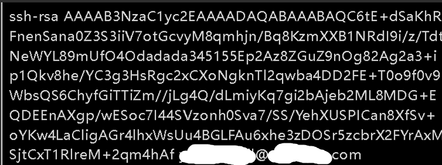
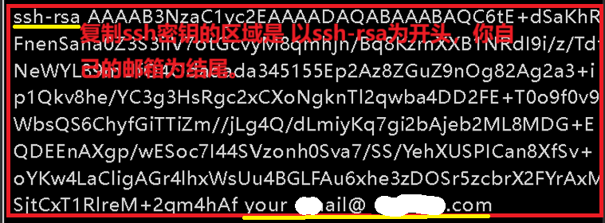

🐻9/30🐻

今天学习了有关git的内容，了解了项目开发的流程等等
# git
下载Git
>官方网站：https://git-scm.cn/downloads/win
# git全局配置
* # 创建user名：
```
git config --global user.name "XXXXXX"  
```
* # 创建user的邮箱：
```
git config --global user.email "xxxxx@xxxx.com"  
```
* # Git密钥配置 

在企业中开发，会先把项目下载到自己电脑上，再进行开发的。但企业中的代码未必是公开的，不是任何人都可以随意下载项目代码的，gitlab 平台(优课达/Github...)会做权限的管理。

所以在开发之前，需要在 gitlab 上进行配置，设置一个 SSH ，把我们的开发环境和 gitlab 连接起来，这样使用 git 操作代码的过程会更加顺利。

在我们我们的开发环境和 gitlab 服务器之间，也有这样的暗号，它的名字叫做 SSH（Secure Shell，安全协议外壳），通常也叫密钥。


  * 生成SSH密钥：

```
ssh-keygen -t rsa -b 4096 -C "XXXXXXXXX@XXX.com"
```
输入后，如果出现 “overwrite(y/n)?” 的提示，敲一个 Y 回车即可
其他情况一路回车，就会生成SSH


  * 查看SSH:

在终端中输入以下命令：
```
cat ~/.ssh/id_rsa.pub
```
输好命令回车后，可以看到很长的、以 “ssh-rsa” 开头、以你自己邮箱结尾的字符内容，这就是 ssh 了：


这个很长的 ssh 看不懂没关系，不用纠结（本来就不是给人看的，是计算机识别的）。

复制 SSH ，下面的步骤会用到。复制的区域为：



# Linux
